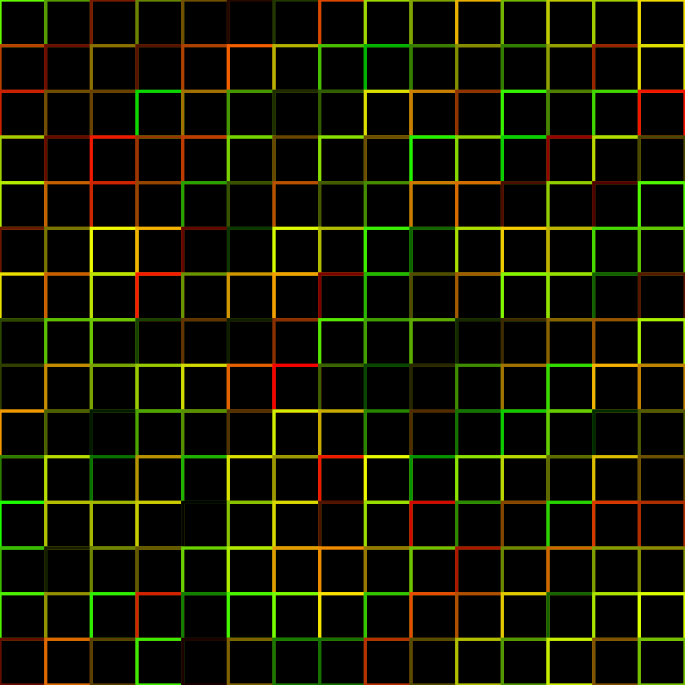
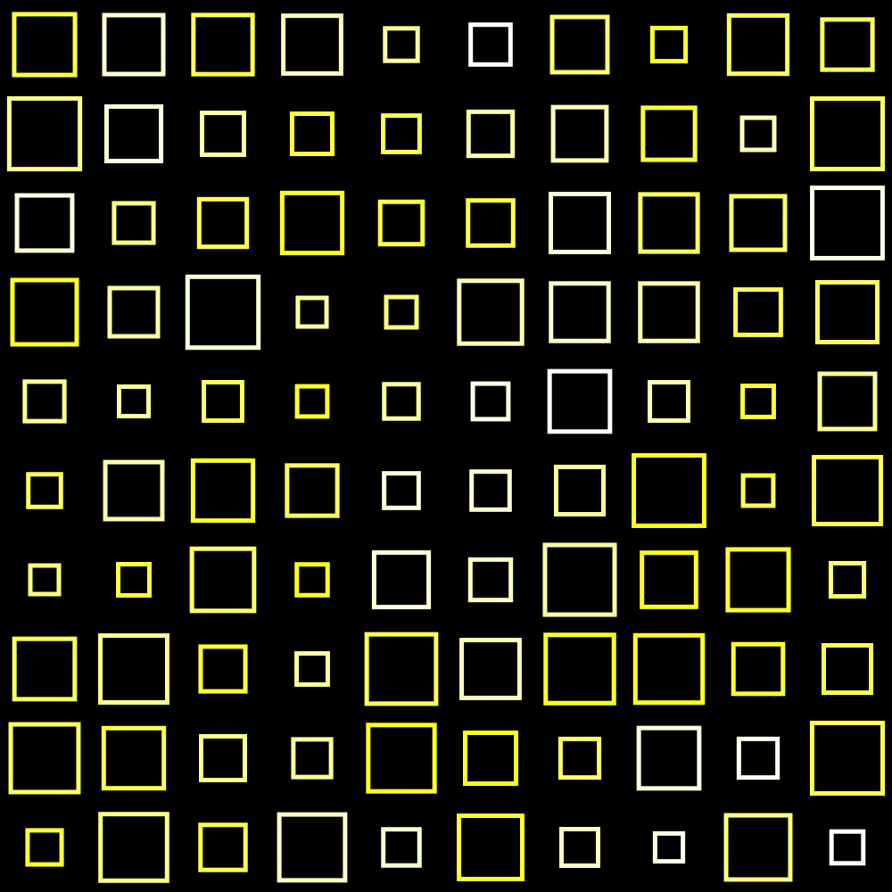
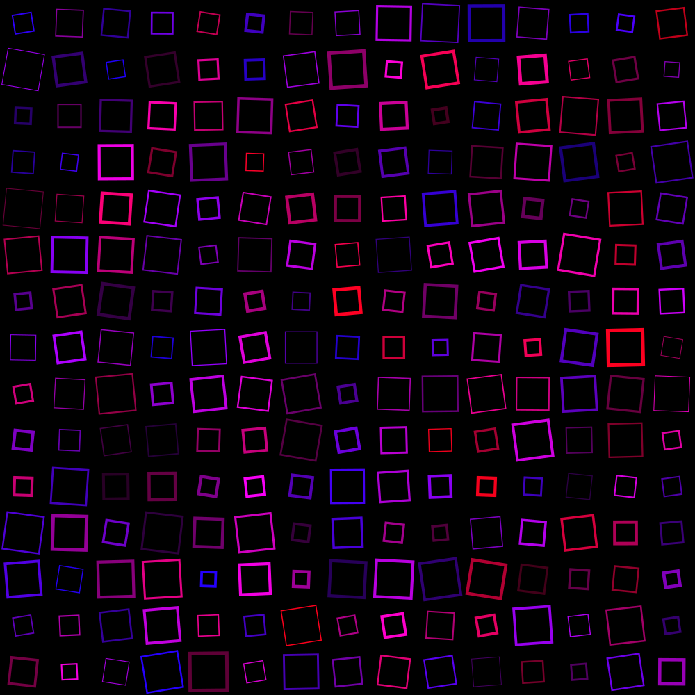
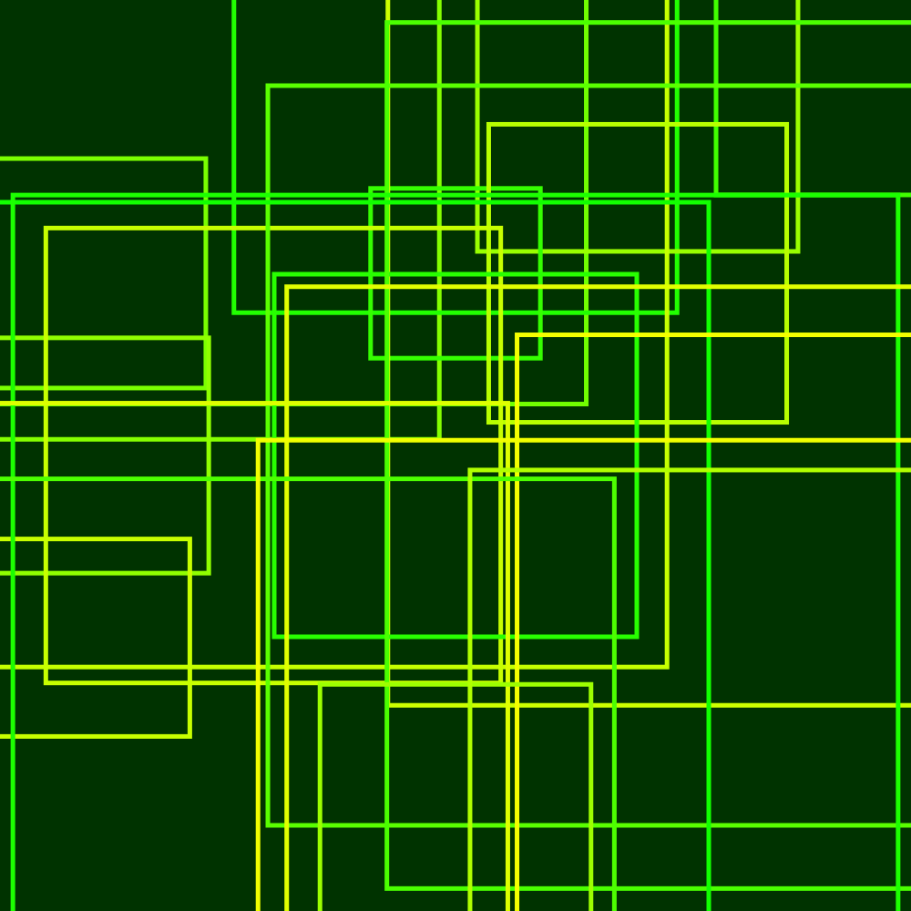
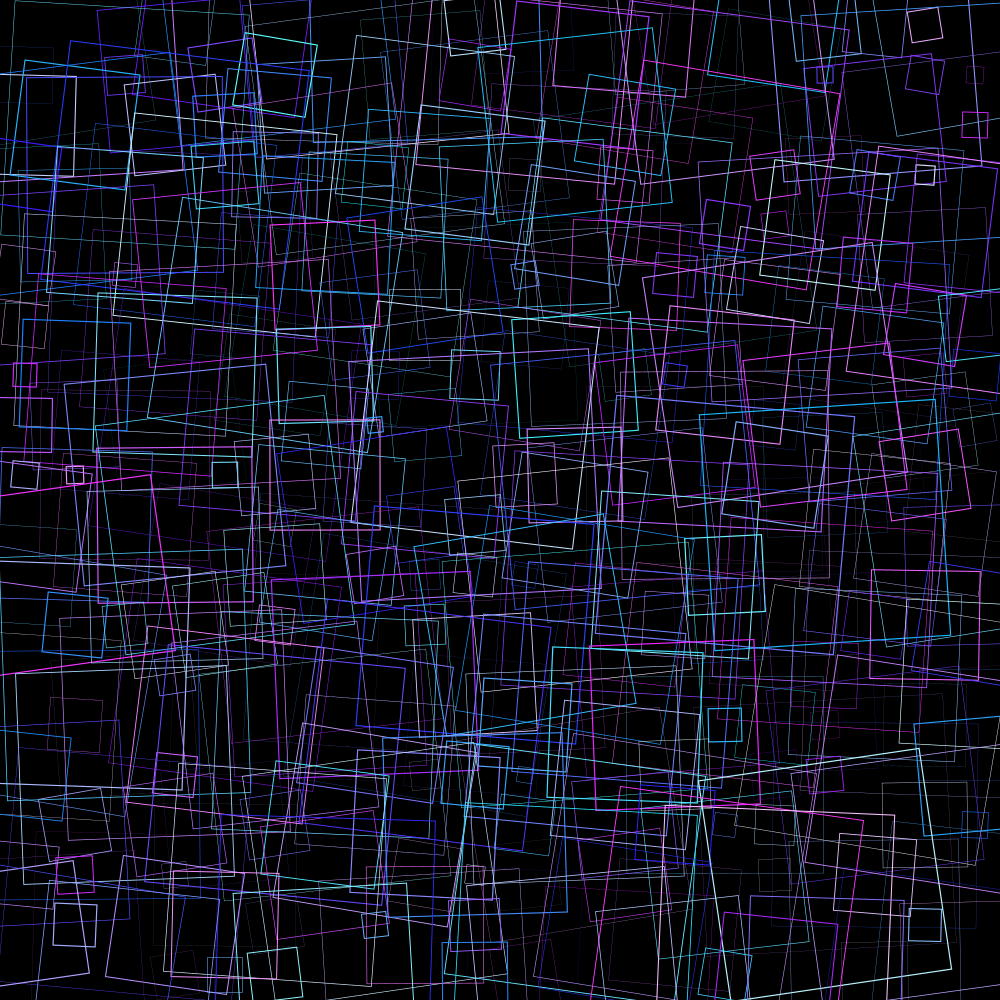

# generative-art-demo
Generative art demo made in Python to showcase a basic example for the Gitcoin grant
This project works by looping through and drawing squares in a grid pattern.
The squares have different aspects that can be randomised such as:
 - Size
 - Rotation
 - Colour
 - thickness

These attributes can be changed with the following lines of code:
```python
# Image Variable Constraints
image_size = 1000
squares_across = 15
background_colour = (0, 0, 0)
colours_min_max = [(0.1, 0, .1), (1, 0, 1)]
size_min_max = [.3, .8]
rotation_min_max = [-10, 10]
line_thickness_min_max = [1, 5]
```
This generator uses the Python package pyCairo to draw the shapes and save the image 
as a .png
The script can easily be altered to produce a wide variety of generated images and 
with further alterations, can loop through and randomly generate any amount that you like.

To get started, simply set up your Python virtual environment on your local machine, 
install the dependencies specified by the requirements.txt file and
run the GenerateArt.py script. Python version used for demo 3.9.6

Run the following command to install the requirements
```bash
pip install -r requirements.txt
```
### Here are some example outputs of what the generator can produce






